<h1 align="center">NyX-Sniffer</h1>

<p align="center">
  <b>Palantir for Discord, built on public info.</b><br>
  Parallel scraper · word wall · activity schedule · social graph · OSINT intel tags<br>
  AI image sorter · device detection · Terms of Service flags<br>
  <sub>Open source · By rScrewed</sub>
</p>

<p align="center">
  <a href="https://ko-fi.com/rscrewed"></a>
</p>

<p align="center">
  
  
  
</p>

<p align="center">
  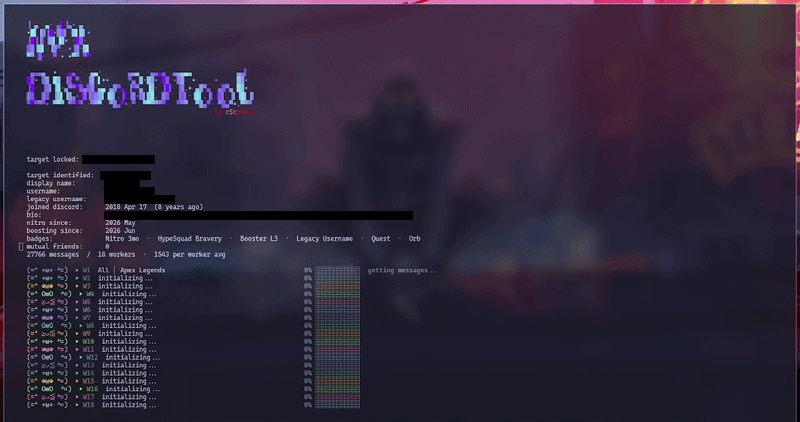
</p>

A terminal-based OSINT tool that sweeps your shared Discord servers for messages, files, and mentions tied to a target user ID. It only uses what your own account can already see in the servers you share with the target. **The terminal only collects the raw data. The browser viewer it opens afterward is what turns that data into a profile.**

---

## Read this before you use it

This tool logs in as a real Discord **user account** (not a bot) and drives it programmatically to search message history, optionally across several accounts ("workers") at once to go faster. That is automation of a user account, which is against **[Discord's Terms of Service](https://discord.com/terms)**.

- **Every account you point at this tool, the main one and any worker tokens, can be disabled or permanently banned.** Do not use an account you aren't prepared to lose.
- **You need authorization from the people you're collecting data on.** A scan doesn't just pull the target's own messages. Depending on the mode it also reads what other members posted (mentions of the target, shared channels, and so on). Only run this where you have a legitimate, consented basis: your own accounts and data, explicit written permission from the target and, where relevant, the server owner, or an authorized security or investigative engagement. "I have access" is not the same as "I have permission."
- Delays, cooldowns, and rate-limit backoff are built in to reduce (not eliminate) the chance of getting flagged. They can be tuned in **Settings**, but no setting makes this safe from Discord's own detection or removes the need for consent.

If you don't have clear authorization to investigate the target and the server(s) involved, don't run this.

---

## What you get

People forget what they've put out there. Months or years of messages spread across a dozen servers add up to more than most people could recall themselves. NyX-Sniffer pulls all of it into one place, and the browser viewer turns that raw dump into a profile instead of a wall of text:

- **Parallel scraper**: add more accounts as workers and NyX-Sniffer splits every server's history between them, so big servers finish in a fraction of the time. Idle workers even help rate-limited ones.
- **Resumable scans**: stop with Ctrl+C at any point and continue later without losing progress or re-downloading files.
- **Word Wall**: the target's most-used words, sized by how often they say them.
- **Mentions and Ranked Mentioners**: who pings them and how often, ranked. This is their real social graph, the accounts they actually talk to. Click a name to pivot into everything that person has said to the target.
- **OSINT intel tags**: messages are auto-tagged when they touch location, work and income, identity, social handles, technical details, physical details, credentials, places and more. Counters cover every message in the export, and filters stay instant on exports with tens of thousands of messages.
  - **Bannable** flags anything that breaks Discord's Terms of Service, about 1,600 phrases across underage users (under 13), child safety, selfbots and token theft, phishing and fake Nitro scams, account and server trading, harassment and threats, doxxing and swatting, hate speech and extremism, self-harm promotion, illegal goods and carding, financial scams, adult solicitation and gore, raids and mass reporting, ban evasion, and cheats and piracy.
  - **Device** recognises files that came from a specific device or app (iPhone photos and screen recordings, Google Pixel, Android, WhatsApp, Snapchat, Windows and macOS screenshots, Sony, Nikon, GoPro, DJI, camera RAW and more) and adds a "from:" chip. Detection is based on file names, not metadata, so treat it as a strong hint rather than proof.
- **Heatmap and Timeline**: exactly when the target is online, by hour and by month, with a daily breakdown per month.
- **Sort Files (AI image sorter)**: sorts the downloaded images into 23 categories with a local AI classifier and discovers new categories on its own. Nothing leaves your machine.
- **Search and filters**: by file type, server and channel, mentioner, or live search. Press Enter in the search box to search every message in the export.

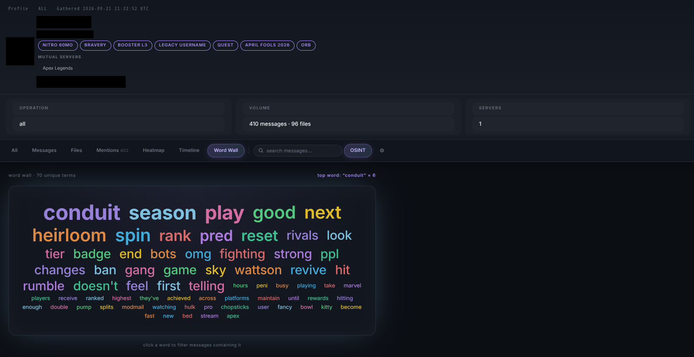

**How much you get back scales with how much the target talks.** A quiet member you barely share a channel with produces a thin file. Someone active, with hundreds or thousands of messages, files, and mentions, turns into a detailed picture of what they are into, who they know, and when they are around.

---

## Table of contents

- [Requirements](#requirements)
- [Quick start](#quick-start)
- [Usage](#usage)
- [Navigating the UI](#navigating-the-ui)
- [Multiple accounts and workers](#multiple-accounts-and-workers)
- [Modes](#modes)
- [Heatmap and Timeline](#heatmap-and-timeline)
- [Sort Files](#sort-files)
- [Settings](#settings)
- [Output](#output)
- [Building a standalone executable](#building-a-standalone-executable)
- [Development](#development)
- [Project structure](#project-structure)

---

## Requirements

- **Node.js 20 or newer** ([nodejs.org](https://nodejs.org)).
- A Discord **user token** for an account that shares servers with the target.
- Optional, for **Sort Files**: Python 3.9 or newer. The dependencies (about 200 MB) are installed on first use into a private `.nyx-venv` folder, after asking.

NyX-Sniffer runs on Windows, macOS, and Linux.

## Quick start

```
git clone https://github.com/rScrewed/NyX-Sniffer.git
cd NyX-Sniffer
npm install
npm start
```

Or download the source zip from the [releases page](https://github.com/rScrewed/NyX-Sniffer/releases), unzip it, and run `npm install` and `npm start` inside the folder.

On the first run:

1. **Paste your Discord token** when prompted. A `.env` file is created in the folder you ran NyX-Sniffer from and the token is saved into it, so you are not asked again.
2. **(Optional) add more workers for speed.** Open `.env` and, instead of the single `Token=` line, add numbered ones:

   ```
   Token1=first_discord_token
   Token2=second_discord_token
   Token3=third_discord_token
   ```

   [More workers means faster results](#multiple-accounts-and-workers). This is the biggest speed lever in the whole tool.

   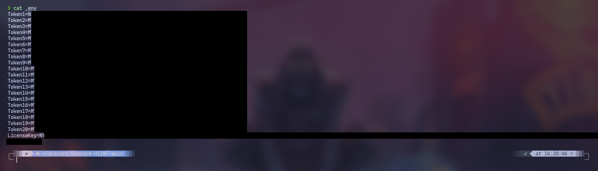

3. Pick **New Scan** from the start menu and enter the target's user ID.

> **Finding a user ID:** enable Developer Mode in Discord settings, right-click any username, and choose **Copy User ID**.

Results, `.env`, and interrupted-scan folders are written to the directory you start NyX-Sniffer from. They are git-ignored by default. Don't remove that before pushing anywhere, since they can contain real personal data.

## Usage

```
npm start
```

or, equivalently, `node bin/nyx.js`.

From the start menu you can start a **New Scan**, **Continue** an interrupted one, **Open Viewer** on past results, **Sort Files** from a finished scan, or change **Settings**.

A new scan walks you through:

1. **Target ID**: the user ID to investigate
2. **Mode**: choose what to collect
3. **Browser viewer**: opens automatically when the scan finishes

Scans can be interrupted (Ctrl+C) and resumed later from the start menu.

**Loading workers**: each token is checked and brought online before the scan starts:

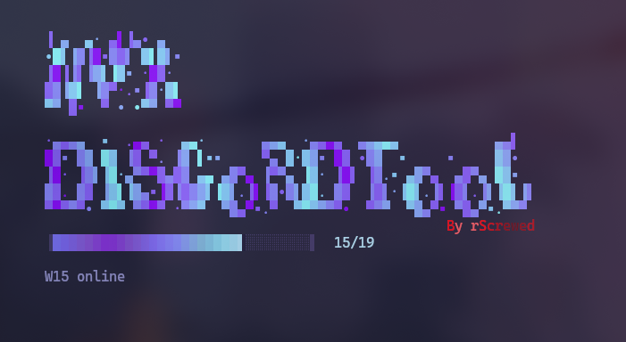

**Discovering servers**: NyX-Sniffer looks up the target's profile and finds the servers you both share (target details hidden):

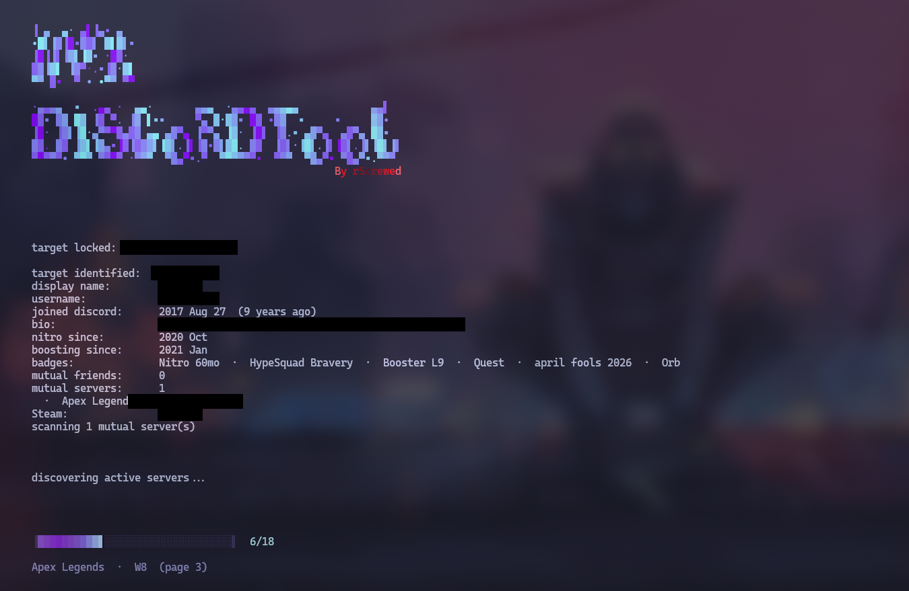

### Re-open saved results

```
npm start -- --view
```

Picks up any output folder automatically. Pass a folder name to open a specific one:

```
npm start -- --view Everything_username
```

If a scan was interrupted before writing JSON (a `_tmp_` folder), the viewer falls back to a paginated file browser with image, video, and audio filters.

### Fix channel names in older scans

Scans made before v2.1.1 show every channel as `#unknown`, because Discord's search results do not include channel names. New scans look the names up automatically. To fix an existing scan without scanning again, run this from the folder that holds your `.env`:

```
npm start -- --resolve-channels Everything_username
```

Leave the folder out to fix every scan folder in the current directory. Channels that were deleted, or that your account cannot see, stay `#unknown`.

---

## Navigating the UI

NyX-Sniffer has two screens. The **terminal menu** collects the raw data, and the **browser viewer** turns it into a profile.

### Terminal menu

Everything is number-driven. Every screen lists options as `[1]`, `[2]`, and so on. Type the number (or a letter like `S` for Settings) and press Enter. `0` (or `b`) backs out to the previous screen. While a scan runs, a live status area (and, with several workers, a pinned row per worker) shows progress in place. **Ctrl+C** stops a scan safely, and it resumes later from **Continue Scan**.

### Browser viewer

- **Tabs** switch between All, Messages, Files, Mentions, Heatmap, Timeline, and Word Wall.
- **Word Wall**: click a word to search every message for it.
- **Mentions tab and Ranked Mentioners**: click any user in the ranking to filter the mentions feed to their messages.
- **OSINT intel badges**: coloured tags on messages that match a category. Click a badge or a filter button to show only those messages. The wordlist panel (the gear button) lets you switch individual terms off, and the counters update across the whole export.
- **Sidebar** lists every server and channel, and highlights where you are as you scroll.
- **Search bar** filters the current page as you type. Press Enter to search everything. The viewer shows 500 messages per page, and the arrow keys change pages.
- **Jump links** on any message open the original in Discord.

Filtering the feed by a category shows only the messages that tripped it:

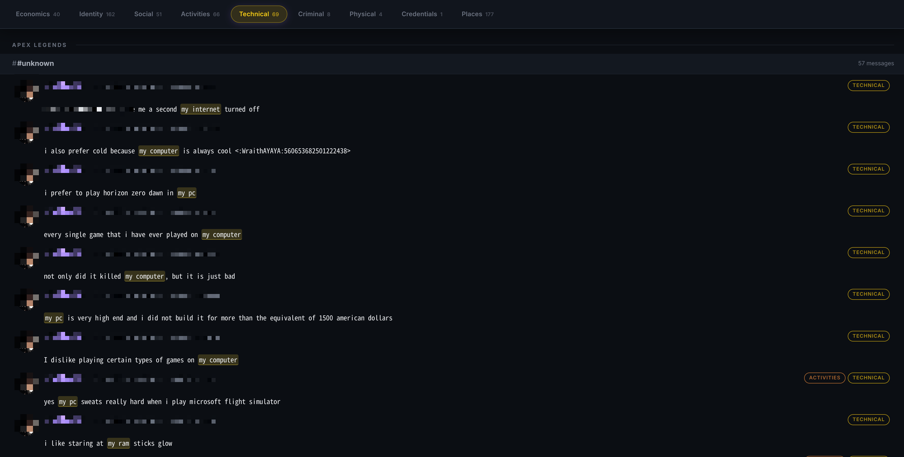

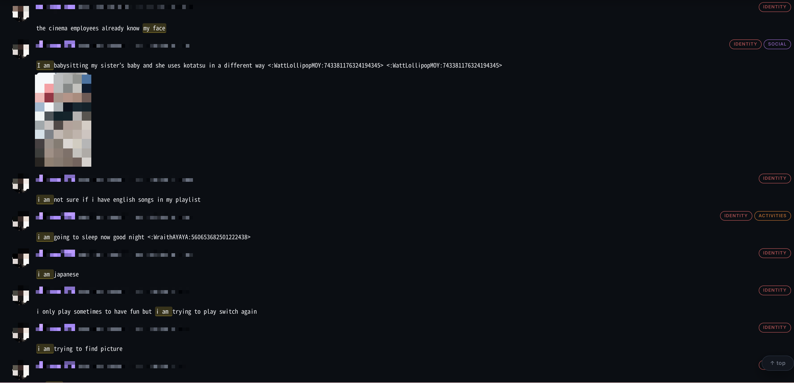

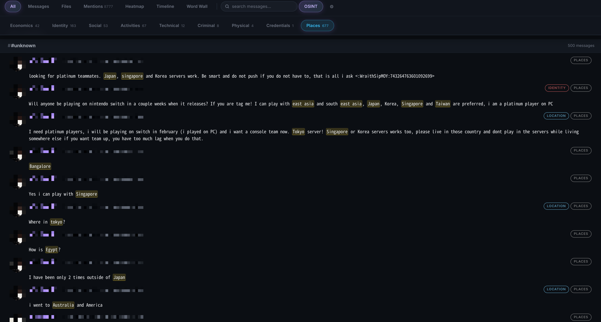

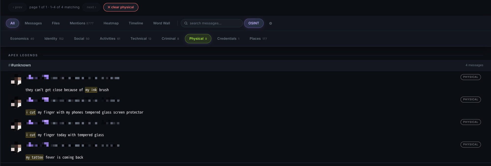

---

## Multiple accounts and workers

**More workers means faster results.** A single-token scan works through a server's message history alone. Each extra token splits the same range across another account running in parallel, so scan time drops roughly in proportion to the number of workers. Number your tokens instead of using a single `Token=`:

```
Token1=first_discord_token
Token2=second_discord_token
Token3=third_discord_token
```

Each token is checked with a live progress bar, then NyX-Sniffer splits the message range for each active server across all workers and runs them in parallel.

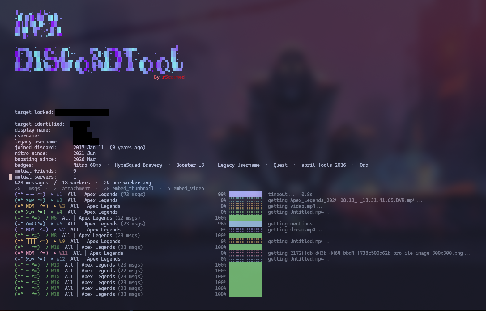

A few things to know:

- **Up to 22 workers are used.** Discord rate limits per IP address, so accounts beyond about 22 stop adding speed. If `.env` holds more tokens, NyX-Sniffer uses the first 22 and tells you.
- **A separate window shows the workers.** With more than 15 workers a second terminal window opens with one row per worker, so the main window stays readable. If no window can be opened (for example over SSH), the main window shows as many worker rows as fit.
- **This multiplies the ban risk described above.** Every token used is a real account being automated.
- A worker only receives work for servers its account is a member of. There is no automatic joining. Join manually with that account first, or scan with a single token.
- If a worker gets rate limited near the end of its range, a finished worker lends its connection to complete the last pages instead of everyone waiting out the full backoff.

---

## Modes

| # | Mode | Description |
|---|------|-------------|
| 1 | **Messages** | Every message the target sent across the servers you share |
| 2 | **Files** | Only messages with attachments, images, videos, and documents |
| 3 | **Mentions** | Every message where the target was pinged, ranked by who sends them most |
| 4 | **All** | Messages, files, and mentions in one pass |

Files are downloaded once per unique file, even when the same file appears in many messages or is reached by several workers.

## Heatmap and Timeline

Available with **Messages** and **All**. Both are shown in the browser viewer.

- **Heatmap**: the top five most active one-hour windows in your local timezone, plus a full 24-hour breakdown saved to `heatmap.txt`.
- **Timeline**: monthly message volume over the full scanned history. Click a month for a daily breakdown.

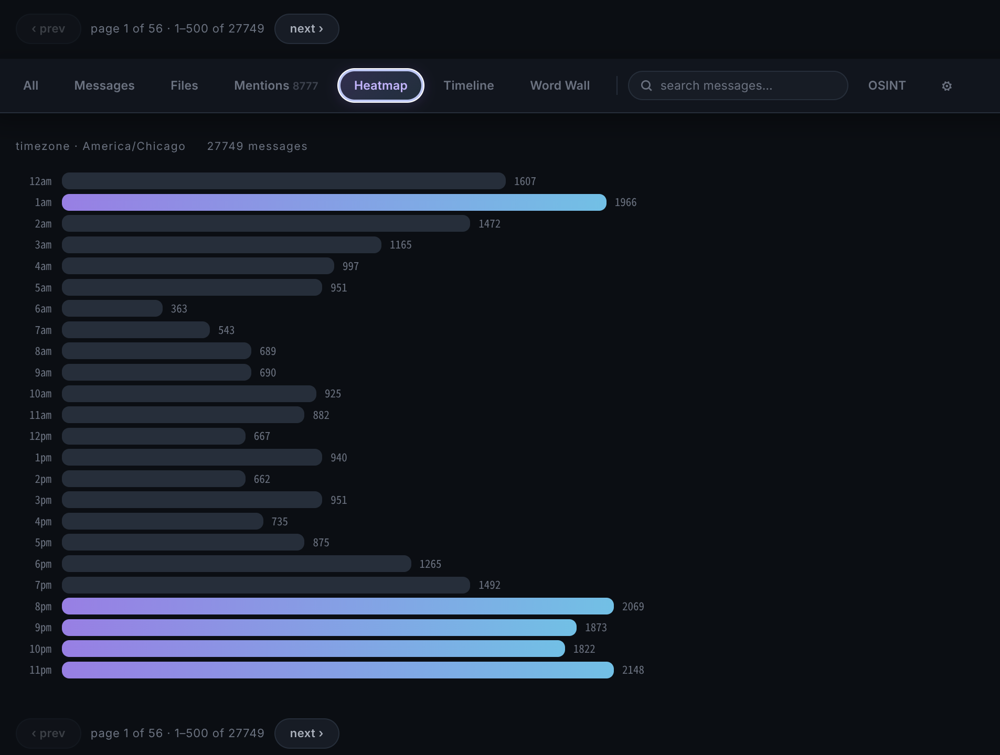

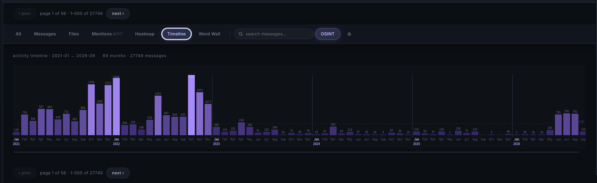

---

## Sort Files

Sorts the images downloaded by a finished scan into folders by what is in them, using a local AI image classifier (CLIP). Nothing is uploaded anywhere. Pick **Sort Files** from the start menu, choose a scan, choose a quality level, and it runs. You can also run the script directly. Install its dependencies first (`torch`, `transformers` and `pillow`, listed in [`python/requirements.txt`](python/requirements.txt)):

```
pip install -r python/requirements.txt
python python/sort_images.py Everything_username --quality balanced
```

- **23 built-in categories**: people and selfies, documents and IDs, chat screenshots, app screenshots, gaming, outdoor locations, home interiors, vehicles, animals, tech hardware, code and terminals, money and finance, weapons, drugs and alcohol, adult content, memes, anime and art, food, nature, fashion, sports, media, and text graphics. The categories are plain text prompts at the top of `python/sort_images.py` and can be edited.
- **New categories are found automatically**: images that do not fit any built-in category are grouped by visual similarity, and each group is named on its own as an `auto_<name>` folder.
- **Quality levels**: **Fast** is quickest but rougher, **Balanced** is the default, and **Best** uses a larger model and is the most accurate but slowest. A GPU speeds all of them up considerably, and large scans on CPU can take hours.
- **Originals are never touched.** Results go to `sorted/<category>/` inside the scan folder as links (or copies with `--copy`), and `sorted/index.json` records each image's category, confidence, and runner-up guesses. Re-running is fast because the image analysis is cached.

## Settings

From the start menu, **Settings** tunes the pacing NyX-Sniffer uses when talking to Discord's API. Values are stored in `.env`.

| Setting | `.env` keys | What it controls |
|---|---|---|
| Page delay | `SEARCH_DELAY_MIN_MS`, `SEARCH_DELAY_MAX_MS` | Wait between consecutive search result pages |
| 1k cooldown | `COOLDOWN_1K_MS` | Longer pause every 1,000 messages collected |
| Server gap | `SERVER_DELAY_MIN_MS`, `SERVER_DELAY_MAX_MS` | Wait between finishing one server and starting the next |
| Rate limit wait | `RATE_LIMIT_WAIT_MS` | Minimum backoff after Discord returns a 429 |

These exist to reduce the chance of triggering Discord's automation detection. They do not eliminate it, and shortening them increases the risk to the account(s) in use.

## Output

Results are saved to a folder named after the mode and username:

```
Messages_username/
Files_username/
Mentions_username/
Everything_username/
```

| File | Contents |
|------|----------|
| `messages.json` | Full message data |
| `messages.txt` | Human-readable report |
| `mentions.json` | Mention data with ranked senders |
| `mentions.txt` | Human-readable mention report |
| `heatmap.json`, `heatmap.txt` | Hourly activity breakdown |
| `timeline.json` | Monthly message volume, used by the viewer |
| `profile.json` | The target's public profile details |
| `files/` | Downloaded attachments, in `images`, `gifs`, `videos`, `audio`, `documents`, and `other` folders |
| `sorted/` | Images sorted by category, plus `index.json` (after **Sort Files**) |

The [AI analyst prompt](docs/ai-analyst.md) describes this layout and can be given to an AI assistant to write a footprint assessment from a scan.

---

## Building a standalone executable

NyX-Sniffer can be packaged as a single executable (a Node single-executable application) so people without Node.js can run it:

```
npm run build            # executable for the current platform, in dist/
npm run build:windows    # Windows executable, in dist-win/, from any platform
```

Ship the whole output folder: the executable needs `viewer.css`, `viewer-client.js`, and `sort_images.py` next to it. The build downloads the official Node binary and verifies its checksum.

## Development

```
npm install
npm test         # unit and integration tests
npm run lint     # ESLint
```

See [docs/architecture.md](docs/architecture.md) for how the code is organised. Contributions are welcome. Please run the tests and the linter before opening a pull request.

## Project structure

```
bin/nyx.js               entry point
src/cli/                 argument handling
src/app/                 interactive application flow
src/config/              runtime paths, .env, settings, scan options
src/discord/             API client, profiles, search queries
src/scan/                search engine, collectors, sequential and parallel runners
src/files/               attachment downloads and folders
src/output/              reports, heatmap, timeline
src/terminal/            terminal UI
src/viewer/              local web viewer (server, rendering, intel tagging, browser client)
src/sorting/             launcher for the image sorter
python/sort_images.py    CLIP image classification
scripts/                 executable build
tests/                   tests
docs/                    documentation
```

## License

[MIT](LICENSE)
